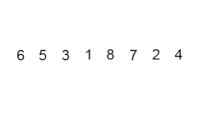

# Ordenamiento Burbuja en JavaScript.




## Introducción.

El ordenamiento burbuja es uno de los algoritmos de ordenación más sencillos. Funciona comparando elementos adyacentes y los intercambia si están en el orden incorrecto. Este proceso se repite hasta que la lista esté ordenada.

## Practica ilustrativa.

*Enunciado*

Para practicar el metodo burbuja implementaremos un programa en `JavaScript`, para organizar un conjunto de números enteros de forma ascendente. Luego, el programa deberá mostrar los números en orden ascendente y descendente.

Para ello, utilice un arreglo de cinco elementos con valores predefinidos. Aplique dos bucles anidados para comparar y ordenar los elementos, asegurándose de intercambiarlos cuando sea necesario.


<hr>

**Código del Algoritmo de método burbuja.**

```JavaScript
    const numeros = [4,3,6,7,8];
    let aux;
        // Método burbuja
    for(let i = 0 ; i <= numeros.length ; i++)
    {
        for(let j = 0 ; j <= numeros.length ; j++)
        {
            if(numeros[j] > numeros[j+1])
            {
                aux = numeros[j];
                numeros[j] = numeros[j + 1];
                numeros[j + 1] = aux;
            }
        }
    }

       // Mostrar el arreglo en orden descendente
   for(let i = numeros.length -1 ; i >= 0  ; i--)
    {
        console.log(numeros[i]);
    }

```
### Video ilustrativo del programa.

<video src="Videos/video1.mp4" controls=""> </video>

<hr>

## Explicación del uso de bucles anidados:

El algoritmo burbuja usa dos bucles anidados porque:

1. El primer bucle (Externo) controla la cantidad de pasadas necesarias para asegurarse de que todos los elementos estén en su posición correcta.

2. El segundo bucle (interno) compara y realiza los intercambios en cada pasada, desplazando los elementos más grandes hacia el final del arreglo.

<br>

<hr>
